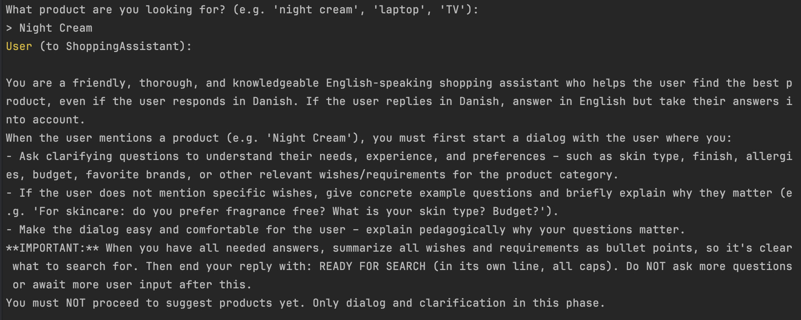
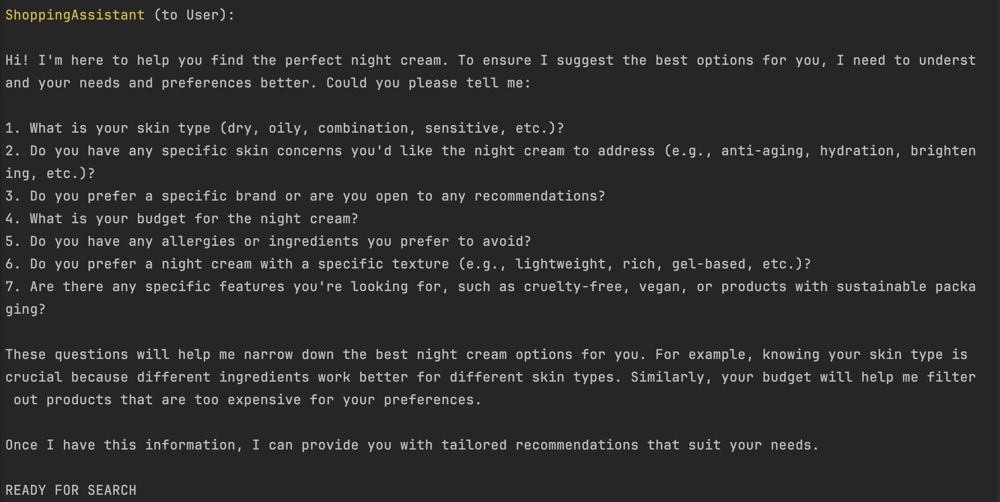
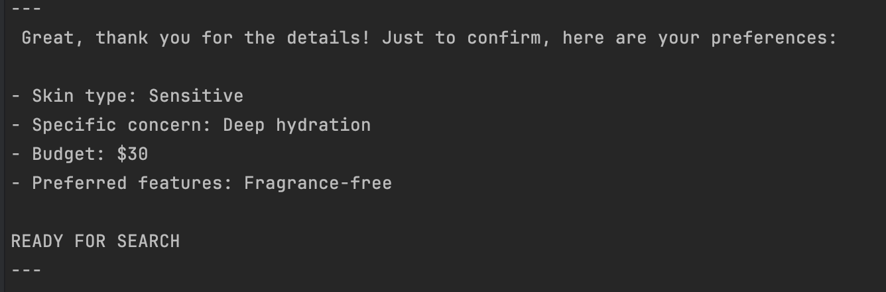
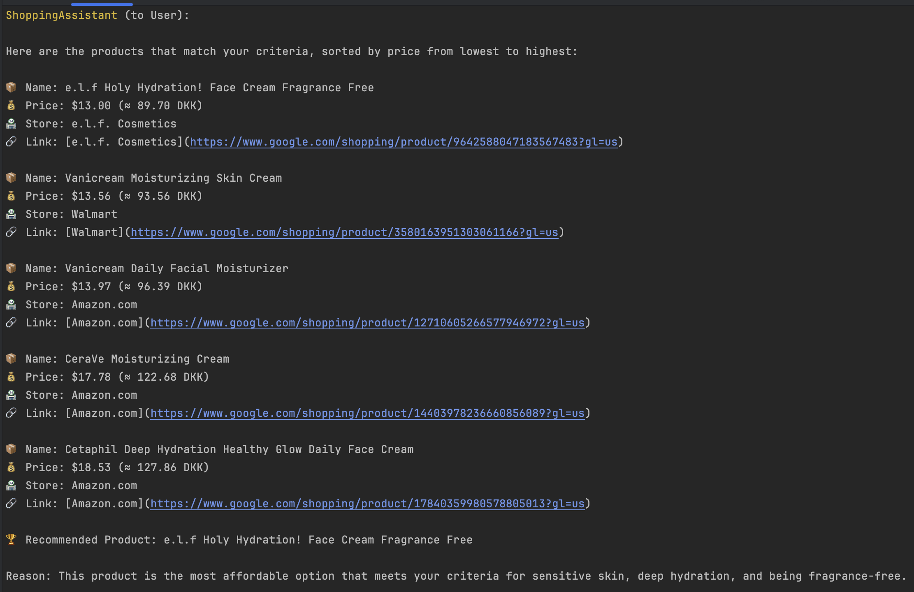
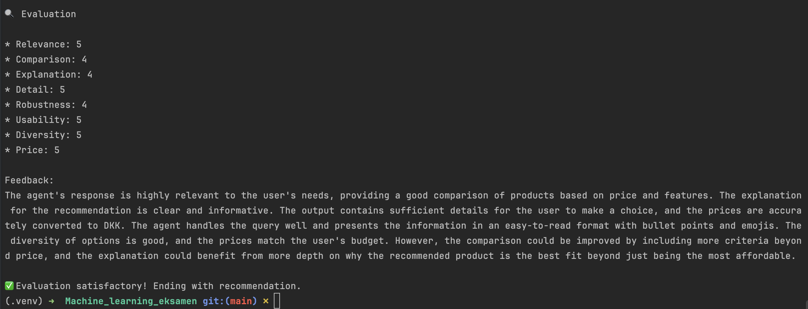

# Example User Cases for Shopping Agent

| Tests | Produkt             | Detaljerede krav/ønsker                                                                                                                               | Sprog   |
|-------|---------------------|-------------------------------------------------------------------------------------------------------------------------------------------------------|---------|
| 1     | night cream         | I have sensitive skin, and I’m looking for a night cream that is deeply hydrating. I have no allergies. I prefer fragrance-free products. My budget is 30 dollars. | English |
| 2     | natcreme            | Jeg har tør hud og vil gerne have en natcreme, der giver meget fugt og gerne er beroligende. Jeg har ikke nogen allergier, og mit budget er 400 kr.   | Danish  |
| 3     | laptop              | I need a laptop for graphic design work. It should have at least 16GB RAM, SSD storage, and a good quality display. My budget is under 1000 USD. I prefer Dell or Lenovo. | English |
| 4     | wireless headphones | Jeg skal bruge trådløse høretelefoner til sport. De må gerne være svedresistente og have god pasform. Det skal ikke være de dyreste.                  | Danish  |
| 5     | face serum          | I have oily skin and want a serum with anti-aging effects. Preferably from The Ordinary if possible. My budget is 40 dollars.                         | English |

---

## Beskrivelse af tabellen

Tabellen ovenfor viser eksempler på forskellige bruger-cases, som kan bruges til at teste shopping-agenten.  
I kolonnen "Produkt" angiver brugeren blot det produkt eller den produktkategori, de ønsker hjælp til at finde.  
I kolonnen "Detaljerede krav/ønsker" uddyber brugeren deres specifikke behov, ønsker, præferencer og eventuelt budget i forhold til produktet.  
Eksemplerne er på både engelsk og dansk for at demonstrere agentens evne til at håndtere flersproget input og forskellige detaljeringsgrader.  
Disse cases kan bruges til at teste og vurdere, hvor godt agenten håndterer forskellige produkttyper og brugerkrav.

---

## Screenshots af Night Cream Test

  
*Billede 1: Agenten beder brugeren om detaljer om natcreme-behov som hudtype, budget og præferencer. Afsluttes med "READY FOR SEARCH".*

  
*Billede 2: Agenten stiller specifikke spørgsmål for at forstå brugerens krav til natcreme bedre.*

  
*Billede 3: Agenten opsummerer brugerens ønsker i punktform og bekræfter klar til søgning med "READY FOR SEARCH".*

  
*Billede 4: Agenten viser en liste med relevante produkter, priser i USD og DKK, butikker og links. Markerede anbefaling med begrundelse.*

  
*Billede 5: Evaluering viser høje scores og positiv feedback på relevans og brugervenlighed. Anbefaler dog bedre forklaring af anbefaling.*

